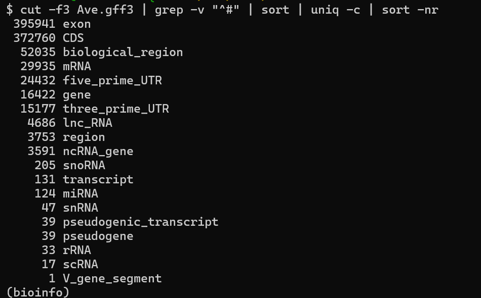
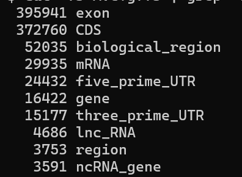

# Analisis  Bioinformatico Calidris pugnax

### Que es un archivo .gff3

Este archivo es un formato usado en bioinformatica que consiste de nueve columnas separadas por tabs la primera columna contienen 

- Nombre, puede ser de la secuencia de el cromosoma del gen etc
- Fuente , de donde se sacaron los datos (NCBI, Genebank, etc.)
- Tipo, si es un CDS, exon, intron ORF etc.
- Comienzo de la secuencia, esto es un numero y habla de la ubicacion de esta 
- Final de la secuencia, de nuevo un numero
- Puntuacion, indicando la confiabilidad de la secuencia  
- Cadena de ADN si es la foward "+" o reverse "-"
- Phase, en caso de ser un gen te dice donde comenzar a leer las tripletas por ejemplo si es uno se comienza a leer el codon en el segundo nucleotido 
- Atributos, indica varias cosas como un id unico si la secuencia es hija de otro ente en el arcivo, si es ADN circular entre otras cosas
- Cuando aparece un "." es porque no aplica o no se conoce 
- ejemplo completo: chrX  GenBank  gene   1000   5000   .  +  .  ID=gene00001;Name=GeneEjemplo

### Calidris pugnax Datos 
- Es un ave limícola que habita en Eurasia y África; el ave presenta tamaño mediano, donde las hembras miden entre 25 y 26 cm, los machos entre 31 y 34 cm, y la envergadura alar de los machos es de 52 a 60 cm. Habita en humedales, marismas y bordes de ríos, donde realizan migraciones estacionales, y se alimenta principalmente de gusanos, insectos y semillas.


### ¿Cuantos features contiene el archivo?
El archivo contiene 19 features ordenadas de mayor incidencia a menor incidencia 


### ¿Cuantas regiones de la secuencia (cromosomas) contiene el archivo?
- Para contestar esto hay que acalrar que se consideraron dos features ya que ambos aluden a regiones de cormosomas, la priemra es biological_region, hay 16442, para region hay que es el otro feature que habla de regiones hay 3753 entradas distintas, se presume que biological_region es una subdivision de region que son las regiones principales y son las que en verdad responden la pregunta propuesta
  
  ### ¿Cuántos genes están listados en el organismo?
- Para el apartado de genes hay 16442 entradas distintas, hay 3591 de ncRNA_gene que son genes que no codifican para proteinas como genes ribosomales por ejemplo, hay 39 pseudogenes que son mutado que no codifican para proteinas  

- tambien se comprobo que cada linea de gen es unica haciendo extrallendo del archvivo cada gen con su respectivo id y comprobando que el numero sea igual al numero de lineas de la columna tres que dicen la palabra gen, se uso el siguiente codigo:

```bash
cut -f3,9 Ave.gff3 | grep -v "^#" | grep -i "^gene" | awk -F'\t' '{ match($2, /gene:([^;]+)/, arr); if(arr[1]!="") print arr[1] }' | sort | uniq | wc -l
```
Nota: se hizo lo mismo para "region" 
### ¿Cuál es el top 10 de tipo de features (columna 3) más anotados en el genoma?

